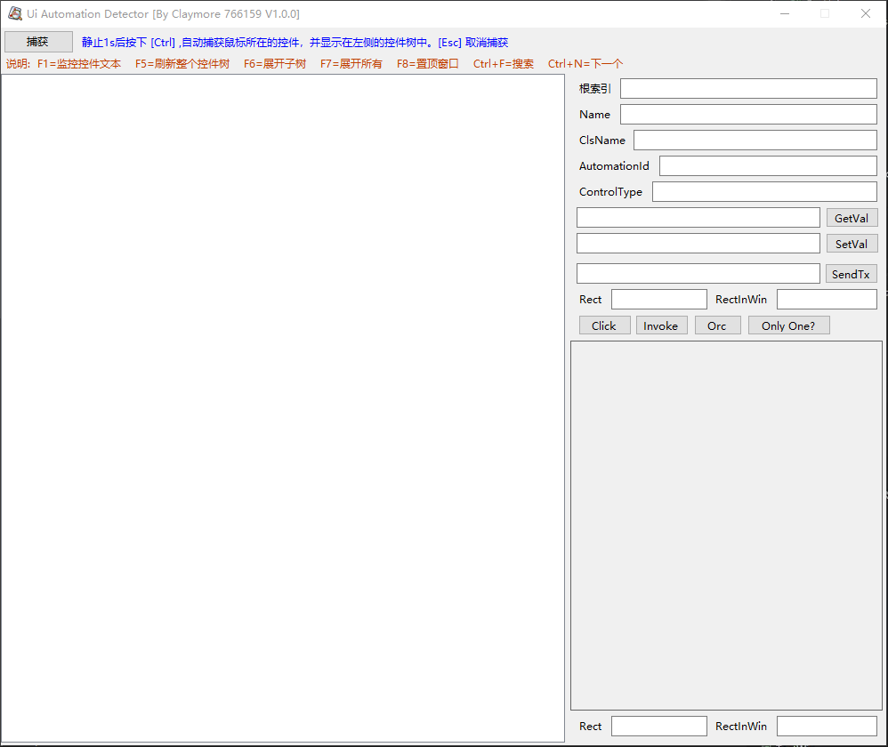

# 🧠 UI Automation Detector

> 一款轻量级、功能强大的 Windows UI 自动化调试工具，用于**实时探测、分析和交互任意窗口控件**。支持捕获鼠标位置控件、查看控件树、读写属性、模拟点击与发送文本等，是自动化测试、逆向工程和软件开发的必备利器。
> 
> 使用过几款类似的，都不尽如人意，要么太卡，要么功能不全，界面丑陋。于是自己写了一个，目前功能已经比较完善，界面也还过得去。希望大家喜欢。
> 
> 主要用了百度的本地ORC识别库，所以大小比较大，以后会优化。
> 

--- 

## ⚙️ 快捷键说明

| 快捷键 | 功能 |
|--------|------|
| `Ctrl` | 捕获鼠标下的控件（需静止1秒） |
| `Esc` | 取消捕获 |
| `F1` | 启动/停止监控控件文本变化 |
| `F5` | 刷新整个控件树 |
| `F6` | 展开当前选中节点的子树 |
| `F7` | 展开所有节点 |
| `F8` | 切换顶层窗口 |
| `Ctrl + F` | 打开搜索框 |
| `Ctrl + N` | 下一个匹配项 | 

---  
